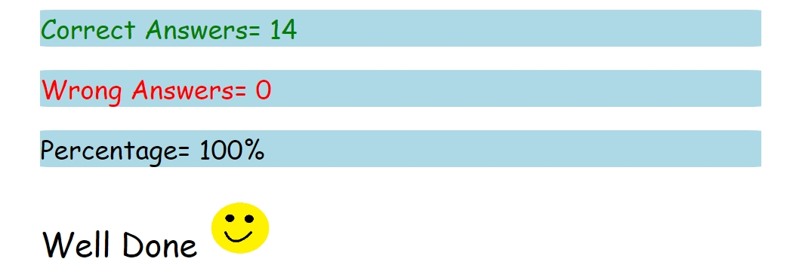

JavaScript
Assignment-2
1.	 What are the variable naming conventions in JavaScript?
     
     - variables are case sensitive
     - variables can be Single character Multiple character or Alpha numeric
     - camel casing
     - only two symbols can be used in variables.
     - variable cannot start with a number
     - variables cannot have spaces

2.	 Create a greeting alert (use => prompt, message, alert)

         let name = prompt("Enter Your Name")
         let message = ("Good Morning")
         alert(`${message} ${name}`)
  
3.	 Write some code so that the values of the below variables switch around 
      Let a = 5, let b = 8. Switch the value so that a holds the value 8 and the variable b holds the value 5

         let a = 5
         let b = 8
         let c = b
         b = a
         a = c
         console.log(a);
         console.log(b);

